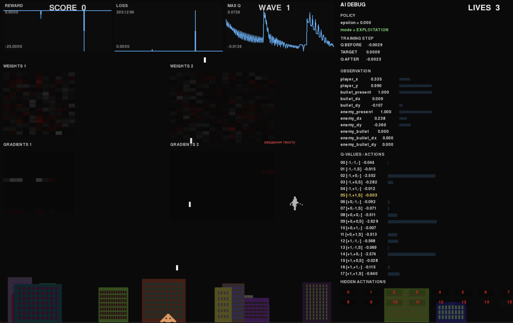

# Alien Invasion

Експериментальний Space Invaders, у якому поступово будується AI-агент і досліджується, як він навчається грати.




## План

### 1. Гра

* Гра з нуля на Pygame.
* Плавна фізика руху.
* Різні типи ворогів і боси.
* Складність зростає між хвилями.

### 2. AI Environment

* Відокремити гру від агента.
* `State → Observation → Action`.
* Визначити простір дій і спостережень.
* Reward для оцінки результату дій.

### 3. Базові агенти

* Random Agent.
* Rule-Based Agent.
* Базові метрики для порівняння.

### 4. Reinforcement Learning

* Q-learning.
* Q-table.
* Exploration / exploitation.
* Дослідження `α`, `γ`, `ε` та reward.
* Експеримент із дискретним і неперервним простором станів.

### 5. Neural Network

* Заміна Q-table на апроксиматор `Q(state, action)`.
* Власна нейронна мережа на NumPy.
* Поступовий перехід до DQN.

### 6. Експерименти

* Запускати багато епізодів.
* Змінювати reward, state, action space та параметри навчання.
* Навмисно ламати окремі компоненти й аналізувати результат.
* Порівнювати стратегії та поведінку агентів.

## Вороги

* **Scout** — швидкий, маневрений.
* **Shooter** — тримає дистанцію та стріляє.
* **Kamikaze** — атакує гравця прямим перехопленням.
* **Dodger** — ухиляється від куль.
* **Tactical** — адаптує поведінку до ситуації.
* **Boss ×3** — окремі моделі поведінки, фази та атаки.

## Фізика

Рух будується за схемою:

```text
input → acceleration → velocity → position
```

Рухомі об'єкти мають `position`, `velocity`, `acceleration`, `drag` та обмеження максимальної швидкості.

## Agent

```text
Controller
    ↓
Action Space
    ↓
Observation Space
    ↓
Random Agent
    ↓
Game ↔ Agent loop
    ↓
Reward / Evaluation
    ↓
Q-learning
    ↓
Q-table
    ↓
Continuous State
    ↓
Neural Network (NumPy)
    ↓
DQN
```

## Дослідницький журнал

Кожен важливий етап оформлюється як окремий експеримент:

```text
experiments/
└── NN/
    ├── conclusions.md
    └── results.png
```

Мета — не просто отримати агента, який грає, а зрозуміти, **чому певні алгоритми працюють або не працюють**.

---

```bash
watchfiles "python main.py"
```
