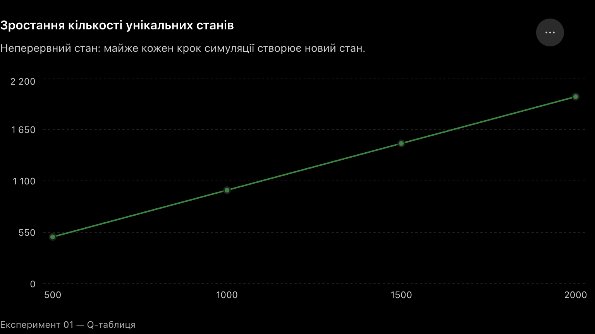

# Висновки — Q-таблиця

Ми реалізували базовий цикл Q-навчання:

`стан → дія → винагорода → новий стан → оновлення Q`

### 1. Q-таблиця працює для дискретного простору

При 8 параметрах стану та 10 можливих значеннях кожного:

`10⁸ = 100 000 000` можливих станів.

При 18 діях це дає до:

`1.8 × 10⁹` Q-значень.

Отже, навіть помірна деталізація стану швидко робить Q-таблицю непрактичною.

### 2. Неперервний стан робить проблему очевидною

Після вимкнення дискретизації за 2 000 кроків ми отримали:

* `2 001` унікальний стан;
* `36 018` Q-значень.

Кількість станів практично дорівнювала кількості кроків.

Причина: Q-таблиця вважає

`523.481 ≠ 523.527`

двома різними значеннями, навіть якщо ситуації практично однакові.

### 3. Головний висновок

Q-таблиця **не узагальнює досвід** між схожими станами. Вона зберігає окреме значення для кожної пари:

`(стан, дія) → Q`

Для складного середовища з неперервним простором станів потрібен механізм, який може апроксимувати:

`Q(стан, дія)`

а не зберігати кожне значення окремо.

